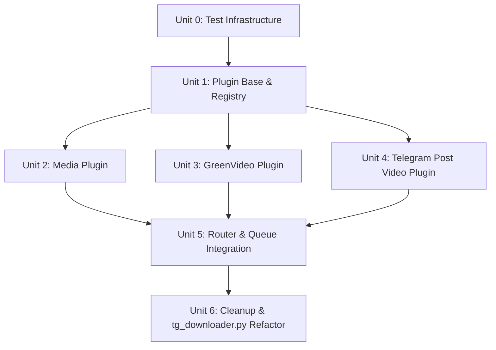

# Refactor to Plugin System with Message Queue

## Overview

This plan restructures the monolithic `tg_downloader.py` (1134 lines) into a plugin-based architecture. Each message type (native media, GreenVideo URLs, Telegram post videos) becomes an independent plugin module implementing a common interface. All incoming messages route through a single global queue (size=1) processed by one worker, ensuring one download at a time.

## Problem Frame

The current codebase has all bot logic — message handlers, workers, queue management, GreenVideo integration, forward listener wiring, and utility functions — in a single file. Adding new download sources requires modifying the central file, duplicating queue/worker patterns, and tightly coupling new features to existing code. The `modules/tools/` directory with GreenVideo shows an intent toward modular tools, but no plugin abstraction exists.

## Requirements Trace

- R1. Define a plugin base class with interfaces that all plugins must implement
- R2. Implement separate plugin modules for each message type (native media, GreenVideo, Telegram post video)
- R3. Route incoming messages to the appropriate plugin based on message content/type
- R4. All messages enter a single global queue with max size 1 (one download at a time)
- R5. Each plugin is defined as a separate module under `modules/plugins/`
- R6. Preserve all existing functionality (commands, callbacks, forward listener, config management)
- R7. Maintain backward compatibility with existing `config.json` and environment variables

## Scope Boundaries

- **In scope**: Plugin base class, plugin registry, message router, queue management refactor, migrating existing download logic into plugins
- **Out of scope**: Adding new download sources, changing forward listener architecture, modifying ConfigManager, changing Docker/deployment setup, adding new bot commands

## Context & Research

### Relevant Code and Patterns

- **`tg_downloader.py`** — Current monolithic file containing all handlers, workers, queues, and utilities
- **`modules/tools/greenvideo/`** — Existing tool module pattern; `PlaywrightGreenVideoDownloader` class with `extract_video_with_interception()` and `download_video()` methods
- **`modules/forward_listener.py`** — Demonstrates dynamic handler registration via `user_client.add_handler()` / `remove_handler()`
- **`modules/ConfigManager.py`** — Config loading/validation pattern to preserve
- **GreenVideo queue design** (`plans/2026-03-15-greenvideo-queue-design.md`) — Existing queue+worker pattern with `asyncio.Queue()`, `task_done()` in `finally`, and abort drain logic
- **`modules/utils/extract.py`** — URL/magnet extraction utilities used by text message handler

### Institutional Learnings

- **Asymmetric mechanism gotcha** (`.trellis/spec/guides/code-reuse-thinking-guide.md`): If plugins are auto-discovered, ensure no parallel manual registration path that can drift
- **Worker/queue pattern** (production code): `while True: job = await queue.get()` with `task_done()` guard, `CancelledError` re-raise, and `abort()` draining all queues
- **Handler registration**: Pyrogram decorators with composable filters; all handlers share identical auth filter prefix

### External References

- None needed — local patterns are sufficient (GreenVideo queue, forward listener registration, module organization)

## Key Technical Decisions

- **ABC-based plugin interface**: Use Python's `abc.ABC` with abstract methods rather than Protocol or duck typing. Rationale: explicit contract enforcement at class definition time, clear IDE support, and runtime error if a plugin forgets to implement a method. The codebase already uses class-based design (`ConfigManager`, `ConfigFile`, `PlaywrightGreenVideoDownloader`).

- **Single global queue (size=1)**: All plugins share one `asyncio.Queue(maxsize=1)`. Rationale: user requirement for one-download-at-a-time; simpler than per-plugin queues; eliminates cross-queue priority/scheduling concerns.

- **Plugin registry via explicit registration**: Plugins are instantiated and registered in a central registry at startup, not auto-discovered via `importlib`. Rationale: avoids the asymmetric mechanism gotcha; explicit is better than implicit for a small number of plugins; easier to debug and test. Auto-discovery can be added later if plugin count grows.

- **Router as message classifier**: A `PluginRouter` class examines incoming messages and returns the matching plugin. Each plugin declares `can_handle(message) -> bool` for classification. Rationale: mirrors the existing `forward_listener.check_type()` pattern; keeps routing logic close to plugin definitions; easy to add new plugins by implementing `can_handle()`.

- **Preserve `tg_downloader.py` as entry point**: The file remains the bot's entry point but delegates message handling to the plugin system. Command handlers and callbacks stay in `tg_downloader.py` (they are control-plane, not download-plane). Rationale: minimal disruption to bot startup/shutdown lifecycle; command handlers don't need plugin abstraction.

- **Plugin module structure**: `modules/plugins/<plugin_name>/` with `__init__.py` exporting the plugin class, and `<plugin_name>.py` containing implementation. Mirrors `modules/tools/greenvideo/` convention.

## Open Questions

### Resolved During Planning

- **Queue size**: Single queue, size=1, as confirmed by user
- **Plugin discovery**: Explicit registration over auto-discovery (see Key Technical Decisions)
- **Command handler placement**: Stay in `tg_downloader.py` — they are control-plane logic, not download logic

### Deferred to Implementation

- **Exact plugin class and method names**: Defer to implementation — the ABC interface will define the contract, but specific naming (e.g., `BasePlugin` vs `DownloaderPlugin`) can be decided during coding
- **Worker timeout handling**: The worker wraps `job.plugin.execute()` in `asyncio.wait_for(task, timeout=config.TG_DL_TIMEOUT)`, exactly as the current worker does. This centralizes timeout behavior across all plugins. The plugin interface must document that `execute()` may be cancelled via `CancelledError` and must handle it gracefully (cleanup, user notification via reply edit).
- **Media rename flow placement**: The media rename flow (callback → client.listen for custom filename) stays in `tg_downloader.py` as a callback handler, not inside `MediaPlugin.execute()`. The callback handler resolves the filename, then enqueues the job. This preserves the current `client.listen()` behavior where the next text message is intercepted for the filename, without introducing routing ambiguity with the text message handler.
- **Progress callback unification**: Define a unified progress callback interface. Each plugin accepts a progress callback in `execute()`. A reasonable signature: `async def on_progress(current: int, total: int, metadata: dict) -> None` where metadata includes file-specific info. The worker creates the callback instance and passes it to `execute()`.
- **Test infrastructure**: The project has no `tests/` directory and AGENTS.md states 'This project does not have a test suite.' Add a preliminary step: create `tests/` directory, `tests/conftest.py` with Pyrogram Client mocks, and `pytest.ini` before Unit 1. Alternatively, note that test file paths are targets for when test infrastructure is added.

## High-Level Technical Design

> *This illustrates the intended approach and is directional guidance for review, not implementation specification. The implementing agent should treat it as context, not code to reproduce.*

### Component Architecture

```
┌─────────────────────────────────────────────────────────┐
│                    tg_downloader.py                      │
│  ┌─────────────┐  ┌──────────────┐  ┌────────────────┐ │
│  │ Command     │  │ Callback     │  │ Message Router │ │
│  │ Handlers    │  │ Handlers     │  │ (on_message)   │ │
│  └─────────────┘  └──────────────┘  └───────┬────────┘ │
│                                              │          │
│                                    Classify  │ message   │
│                                              ▼          │
│  ┌──────────────────────────────────────────────────┐   │
│  │              PluginRouter                         │   │
│  │  ┌─────────┐ ┌──────────┐ ┌───────────────────┐  │   │
│  │  │ Media   │ │GreenVideo│ │TelegramPostVideo  │  │   │
│  │  │ Plugin  │ │ Plugin   │ │ Plugin            │  │   │
│  │  └────┬────┘ └────┬─────┘ └────────┬──────────┘  │   │
│  └───────┼───────────┼────────────────┼─────────────┘   │
│          │           │                │                  │
│          ▼           ▼                ▼                  │
│  ┌──────────────────────────────────────────────────┐   │
│  │           asyncio.Queue(maxsize=1)                │   │
│  │         (single global download queue)            │   │
│  └──────────────────────┬───────────────────────────┘   │
│                         │                               │
│                         ▼                               │
│  ┌──────────────────────────────────────────────────┐   │
│  │              worker() — single loop               │   │
│  │  job = await queue.get()                          │   │
│  │  job.plugin.execute(job.message, job.reply)       │   │
│  │  queue.task_done()                                │   │
│  └──────────────────────────────────────────────────┘   │
└─────────────────────────────────────────────────────────┘
```

### Message Flow

```
Telegram message arrives
    ↓
Pyrogram dispatches to @app.on_message(filters.media | filters.text)
    ↓
PluginRouter.classify(message) → iterates plugins, calls can_handle()
    ↓
Matched plugin found → enqueue(message, reply, plugin_instance)
    ↓
Queue (maxsize=1) → blocks if full (backpressure)
    ↓
worker() picks up job → plugin.execute(message, reply)
    ↓
Plugin handles download, progress updates, error handling
    ↓
queue.task_done() → next job
```

### Plugin Interface (Conceptual)

```
class BasePlugin(ABC):
    name: str                          # Plugin identifier
    def can_handle(self, message) -> bool   # Classification
    async def execute(self, message, reply) -> None  # Download logic
    async def cleanup(self) -> None    # Optional: resource cleanup on shutdown
```

## Implementation Units



- [ ] **Unit 0: Test Infrastructure**

**Goal:** Create the test scaffolding needed for all subsequent units.

**Requirements:** R6

**Dependencies:** None

**Files:**
- Create: `tests/__init__.py`
- Create: `tests/conftest.py`
- Create: `tests/plugins/__init__.py`
- Create: `pytest.ini` or `pyproject.toml` pytest section

**Approach:**
- Create `tests/` directory structure mirroring `modules/plugins/`
- Create `conftest.py` with pytest fixtures: mock Pyrogram `Client`, mock `Message` objects for different media types, mock `ConfigManager`
- Configure pytest in `pytest.ini` or `pyproject.toml`
- Use `unittest.mock.AsyncMock` for async methods (matching existing GreenVideo test pattern)
- Keep fixtures minimal — only what's needed for plugin unit tests

**Patterns to follow:**
- `modules/tools/greenvideo/tests/test_playwright_downloader.py` — existing test pattern using `unittest.TestCase` and `unittest.IsolatedAsyncioTestCase`
- AGENTS.md: Add tests when introducing new features

**Test scenarios:**
- Test expectation: none -- this is scaffolding only; verification is that pytest discovers and runs tests

**Verification:**
- `pytest tests/` runs without import errors
- Mock fixtures are available to all test files
- At least one smoke test passes to confirm infrastructure works

- [ ] **Unit 1: Plugin Base Class and Registry**

**Goal:** Define the abstract plugin interface and a registry for plugin management.

**Requirements:** R1, R5

**Dependencies:** None

**Files:**
- Create: `modules/plugins/__init__.py`
- Create: `modules/plugins/base.py`
- Test: `tests/plugins/test_base.py`

**Approach:**
- Create `BasePlugin` as an ABC with abstract methods: `name` (class property), `can_handle(message) -> bool`, `async execute(message, reply) -> None`, and optional `async cleanup() -> None`
- Create `PluginRegistry` class with `register(plugin)`, `get_all() -> list[BasePlugin]`, and `find_plugin(message) -> BasePlugin | None`
- Registry uses a simple list; `find_plugin()` iterates and calls `can_handle()` on each, returning the first match
- Follow the existing `ConfigManager` class pattern for naming and docstrings

**Execution note:** Implement test-first — define the ABC interface, then write tests verifying that incomplete implementations raise `TypeError`.

**Patterns to follow:**
- `modules/models/ConfigFile.py` — class-based data structure pattern
- `modules/ConfigManager.py` — class organization and docstring style
- AGENTS.md: PascalCase classes, snake_case methods, Python 3.10+ union syntax

**Test scenarios:**
- Happy path: Register multiple plugins, `find_plugin()` returns correct match when `can_handle()` returns True
- Happy path: `get_all()` returns all registered plugins in registration order
- Edge case: `find_plugin()` returns None when no plugin matches
- Edge case: Multiple plugins return True for `can_handle()` — first registered wins
- Error path: Instantiating a subclass that doesn't implement all abstract methods raises TypeError

**Verification:**
- `BasePlugin` cannot be instantiated directly
- Concrete subclasses must implement all abstract methods
- Registry correctly stores, retrieves, and finds plugins

- [ ] **Unit 2: Native Media Plugin**

**Goal:** Extract the existing native Telegram media download logic (photo, video, document, audio, animation, voice) from `tg_downloader.py` into a dedicated plugin.

**Requirements:** R2, R4, R5

**Dependencies:** Unit 1

**Files:**
- Create: `modules/plugins/media_plugin/__init__.py`
- Create: `modules/plugins/media_plugin/media_plugin.py`
- Modify: `modules/plugins/__init__.py` (export)
- Test: `tests/plugins/test_media_plugin.py`

**Approach:**
- Create `MediaPlugin` extending `BasePlugin`
- `can_handle()` returns True for `filters.media` messages that are not in the unsupported types list (sticker, contact, location, venue, poll, web_page, dice, game, video_note)
- `execute()` contains the existing download logic: filename resolution (with rename callback for photo/voice), `message.download()` with progress callback, timeout handling, and status message updates
- Extract `get_extension()` and `format_duration()` helpers into the plugin module or a shared utils module
- Handle the media rename flow inline (callback data for yes/no → client.listen for custom name) — this requires the plugin to have access to the Pyrogram client for `client.listen()`. Pass client as a constructor dependency.
- Preserve the existing `safe_edit_message()` usage for progress updates

**Patterns to follow:**
- `modules/tools/greenvideo/playwright_downloader.py` — class-based downloader with async methods
- Existing `worker()` function in `tg_downloader.py` (lines 492-549) — download logic to extract
- Existing `media_message()` handler (lines 867-911) — media classification logic to extract
- Existing `media_rename_callback()` (lines 988-1027) — rename flow to integrate into plugin

**Test scenarios:**
- Happy path: `can_handle()` returns True for video message with filename
- Happy path: `can_handle()` returns True for document message with filename
- Happy path: `can_handle()` returns True for photo message (triggers rename flow)
- Edge case: `can_handle()` returns False for sticker type
- Edge case: `can_handle()` returns False for contact type
- Edge case: `can_handle()` returns False for media without filename when not photo/voice
- Error path: Download timeout → edit reply with timeout error message
- Error path: Download exception → edit reply with error details
- Integration: Plugin receives message, downloads to configured path, updates progress

**Verification:**
- Plugin correctly identifies all supported media types
- Plugin correctly rejects unsupported media types
- Download completes with correct file path and progress updates
- Error cases produce appropriate user-facing messages

- [ ] **Unit 3: GreenVideo Plugin**

**Goal:** Extract the existing GreenVideo URL download logic into a dedicated plugin.

**Requirements:** R2, R4, R5

**Dependencies:** Unit 1

**Files:**
- Create: `modules/plugins/greenvideo_plugin/__init__.py`
- Create: `modules/plugins/greenvideo_plugin/greenvideo_plugin.py`
- Modify: `modules/plugins/__init__.py` (export)
- Test: `tests/plugins/test_greenvideo_plugin.py`

**Approach:**
- Create `GreenVideoPlugin` extending `BasePlugin`
- `can_handle()` returns True for text messages containing a non-Telegram URL (use `extract.extract_url()` and `extract.is_telegram_link()`)
- `execute()` contains the existing `download_greenvideo()` logic: parse URL, call `PlaywrightGreenVideoDownloader.extract_video_with_interception()`, download with progress callback, update status messages
- Reuse the existing `PlaywrightGreenVideoDownloader` from `modules/tools/greenvideo/` — no need to rewrite the downloader itself
- Remove the GreenVideo-specific queue and worker from `tg_downloader.py` — this plugin now uses the shared global queue
- Preserve the existing progress callback pattern and `safe_edit_message()` usage

**Patterns to follow:**
- Existing `download_greenvideo()` function in `tg_downloader.py` (lines 261-346) — logic to extract
- Existing `greenvideo_progress_callback()` (lines 697-735) — progress formatting to reuse
- `modules/tools/greenvideo/playwright_downloader.py` — external dependency to import

**Test scenarios:**
- Happy path: `can_handle()` returns True for text message with YouTube URL
- Happy path: `can_handle()` returns True for text message with generic video URL
- Edge case: `can_handle()` returns False for text message with Telegram link (handled by TelegramPostVideoPlugin)
- Edge case: `can_handle()` returns False for text message without URL
- Edge case: `can_handle()` returns False for non-text messages
- Error path: URL parsing fails → edit reply with error message
- Error path: No downloadable video found → edit reply with "无法解析" message
- Error path: Download timeout → edit reply with timeout error
- Integration: Plugin extracts video info, downloads files, reports completion with file count

**Verification:**
- Plugin correctly classifies text messages with non-Telegram URLs
- GreenVideo downloader is reused without modification
- Download completes with correct file list and status updates

- [ ] **Unit 4: Telegram Post Video Plugin**

**Goal:** Extract the existing Telegram post video download logic into a dedicated plugin.

**Requirements:** R2, R4, R5

**Dependencies:** Unit 1

**Files:**
- Create: `modules/plugins/telegram_post_plugin/__init__.py`
- Create: `modules/plugins/telegram_post_plugin/telegram_post_plugin.py`
- Modify: `modules/plugins/__init__.py` (export)
- Test: `tests/plugins/test_telegram_post_plugin.py`

**Approach:**
- Create `TelegramPostVideoPlugin` extending `BasePlugin`
- `can_handle()` returns True for text messages containing a Telegram link (use `extract.extract_url()` and `extract.is_telegram_link()`)
- `execute()` contains the existing `download_telegram_post_video()` logic: parse URL, resolve chat, get message, download video, report completion
- Needs access to the Pyrogram client for `app.get_chat()` and `app.get_messages()` — pass client as constructor dependency
- Preserve all existing error handling (UsernameNotOccupied, ChannelInvalid, MessageIdInvalid, etc.)
- Use `format_size()` helper for file size display

**Patterns to follow:**
- Existing `download_telegram_post_video()` function in `tg_downloader.py` (lines 759-838) — logic to extract
- Existing `text_message()` handler (lines 738-756) — URL extraction logic to understand routing

**Test scenarios:**
- Happy path: `can_handle()` returns True for text message with t.me/username/post_id link
- Edge case: `can_handle()` returns False for text message with non-Telegram URL
- Edge case: `can_handle()` returns False for text message without URL
- Error path: Invalid link format → edit reply with format error message
- Error path: Channel not found → edit reply with "频道不存在" message
- Error path: No video in post → edit reply with "该消息中没有视频" message
- Error path: Message deleted → edit reply with "消息不存在" message
- Integration: Plugin resolves channel, downloads video, reports file size and duration

**Verification:**
- Plugin correctly identifies Telegram post links
- Channel resolution and video download work correctly
- All error cases produce appropriate Chinese-language error messages

- [ ] **Unit 5: Router and Queue Integration**

**Goal:** Implement the `PluginRouter` and refactor the global queue/worker to use the plugin system.

**Requirements:** R3, R4

**Dependencies:** Unit 1, Unit 2, Unit 3, Unit 4

**Files:**
- Create: `modules/plugins/router.py`
- Modify: `modules/plugins/__init__.py` (export Router)
- Modify: `tg_downloader.py` (integrate router and new queue)
- Test: `tests/plugins/test_router.py`

**Approach:**
- Create `PluginRouter` class with `register_plugin(plugin)`, `classify(message) -> BasePlugin | None`
- `classify()` iterates registered plugins, calls `can_handle(message)`, returns first match
- Create a unified `enqueue_job(message, reply, plugin)` function that sends a 'queued' reply message BEFORE calling `await queue.put()`, matching the current GreenVideo pattern. This ensures the user sees immediate feedback even when the queue is full and the handler blocks on `put()`.
- Replace the existing `queue: Queue` with `asyncio.Queue(maxsize=1)`
- Replace the existing `worker()` function to: get job from queue, wrap `job.plugin.execute()` in `asyncio.create_task()`, append to global `tasks` list (preserving current abort cancellation behavior), await task with `asyncio.wait_for()` timeout, handle errors, call `task_done()`
- The `tasks` list tracking is critical: the current `abort()` function (line 442) cancels in-progress downloads by iterating `tasks` and calling `t.cancel()`. Without this, `/abort` can only drain the queue — it cannot cancel a download that is already running
- Remove the GreenVideo-specific queue (`greenvideo_queue`) and worker (`greenvideo_worker`) — their logic is now in `GreenVideoPlugin`
- Update `generate_workers()` to create a single worker task (since queue size is 1)
- Update `enqueue_greenvideo_job()` calls to use the unified `enqueue_job()` instead
- The `media_message()` handler becomes: classify → if MediaPlugin, handle rename flow → enqueue
- The `text_message()` handler becomes: classify → if plugin found, enqueue; if no match, replicate current fallback: echo plain text back, echo magnet links, or send 'unsupported' message. The fallback logic must be explicit — do not silently drop messages.

**Patterns to follow:**
- Existing `enqueue_job()` function (line 475-478) — pattern to extend
- Existing `worker()` function (lines 492-549) — worker loop to refactor
- `modules/forward_listener.py` — dynamic handler registration pattern for reference
- Existing `abort()` function — must drain the single queue (remove GreenVideo queue drain logic)

**Test scenarios:**
- Happy path: Router classifies media message → returns MediaPlugin
- Happy path: Router classifies text with YouTube URL → returns GreenVideoPlugin
- Happy path: Router classifies text with Telegram link → returns TelegramPostVideoPlugin
- Edge case: Router returns None for unsupported message (e.g., plain text without URL)
- Edge case: Queue is full (size=1) → enqueue blocks until worker picks up job
- Integration: Message flows from handler → router → queue → worker → plugin.execute()
- Integration: Two messages sent rapidly → second waits in queue until first completes

**Verification:**
- Router correctly dispatches all message types to the right plugin
- Single queue enforces one-download-at-a-time
- No messages are lost or silently dropped
- `abort()` correctly drains the queue and cancels the worker

- [ ] **Unit 6: Cleanup and tg_downloader.py Refactor**

**Goal:** Clean up `tg_downloader.py` to use the plugin system, remove obsolete code, and ensure proper lifecycle management.

**Requirements:** R6, R7

**Dependencies:** Unit 1, Unit 2, Unit 3, Unit 4, Unit 5

**Files:**
- Modify: `tg_downloader.py` (major refactor)
- Modify: `modules/plugins/__init__.py` (convenience exports)
- Test: `tests/plugins/test_integration.py`

**Approach:**
- In `tg_downloader.py`:
  - Import plugin modules and create `PluginRegistry` instance
  - Instantiate all plugins (MediaPlugin, GreenVideoPlugin, TelegramPostVideoPlugin) with required dependencies (config_manager, client)
  - Register plugins in the registry
  - Create `PluginRouter` and register all plugins
  - Replace `media_message()` handler: use router to classify, then enqueue
  - Replace `text_message()` handler: use router to classify, then enqueue (or echo back if no match)
  - Remove `download_greenvideo()`, `download_telegram_post_video()`, `enqueue_greenvideo_job()`, `greenvideo_worker()`, `greenvideo_progress_callback()` — all moved to plugins
  - Remove `greenvideo_queue`, `greenvideo_worker_task` globals
  - Simplify `generate_workers()` to create one worker (queue size = 1); remove the `quantity` parameter since it's always 1
  - Update `set_max_parallel_dl_callback`: save new value to config for display in `/status`, but skip `abort(kill_workers=True)` and `generate_workers()` calls — concurrency is now fixed at 1
  - Update `abort()` to drain the single queue and cancel the single worker
  - Remove `greenvideo_queue` drain logic from `abort()`
  - Keep all command handlers, callback handlers, and forward listener handlers unchanged
  - Keep `safe_edit_message()`, `format_duration()`, `format_size()`, `get_extension()` — either as module-level helpers or move to a shared utils module
- Update `init()` to pass the Pyrogram client to plugins that need it
- Ensure `abort(kill_workers=True)` in `main()`'s finally block still works correctly
- Verify `config.json` and environment variable loading is unchanged

**Patterns to follow:**
- Existing `init()` function — extend to wire up plugins
- Existing `main()` function — preserve start/stop/idle lifecycle
- Existing `abort()` function — simplify queue drain logic
- AGENTS.md: Keep import order (stdlib → third-party → local)

**Test scenarios:**
- Happy path: Bot starts, all plugins registered, worker running
- Happy path: Media message → classified → queued → downloaded → completed
- Happy path: Text with URL → classified → queued → downloaded → completed
- Edge case: Unsupported message → no plugin match → appropriate fallback (echo or ignore)
- Error path: Bot shutdown → abort() drains queue, cancels worker, no orphaned tasks
- Integration: Full flow from message receipt to file download with plugin system
- Integration: Config changes (download path, max parallel) still work via command handlers

**Verification:**
- Bot starts and runs without errors
- All existing message types are handled correctly
- All existing commands and callbacks still work
- `abort` command correctly stops pending downloads
- No regressions in forward listener functionality
- Config management unchanged

## System-Wide Impact

- **Interaction graph:** The `media_message()` and `text_message()` handlers change from direct download logic to router-based classification. The `abort()` function simplifies (one queue instead of two). Command handlers and callback handlers are unchanged. Forward listener is unchanged.
- **Error propagation:** Each plugin handles its own errors and edits the reply message. The worker catches unhandled exceptions and logs them. Error propagation pattern is unchanged from current behavior.
- **State lifecycle risks:** The single queue with size=1 means messages block when the queue is full. This is intentional (one download at a time) but means users will see their messages wait rather than be rejected. The `abort()` function must correctly drain the queue to avoid orphaned jobs.
- **API surface parity:** No external API changes — the bot's user-facing behavior (commands, messages, callbacks) is preserved.
- **Integration coverage:** The router → queue → worker → plugin flow is the critical cross-layer scenario. Unit tests for individual plugins plus an integration test for the full flow are needed.
- **Unchanged invariants:** Authorization checks (`filters.user(users=...)`) remain on all handlers. Config loading via `ConfigManager` is unchanged. Forward listener functionality is unchanged — forward listener handlers are registered on specific chat IDs (not private chats) via `add_handler()`, so they cannot conflict with the plugin router which only handles private messages. `safe_edit_message()` rate limiting is unchanged.

## Risks & Dependencies

| Risk | Mitigation |
|------|------------|
| **Regression in message handling** — Refactoring monolithic handlers into plugins may introduce subtle behavior changes | Preserve existing logic exactly; test each plugin against the same inputs the original handlers received; integration test for full flow |
| **Queue deadlock** — Queue size=1 with blocking enqueue could hang if worker crashes | Worker has `CancelledError` re-raise and exception handling; `abort()` drains queue on shutdown; test worker crash recovery |
| **Plugin ordering dependency** — `can_handle()` order matters if multiple plugins could match | Document plugin registration order; ensure `can_handle()` predicates are mutually exclusive (Telegram link vs non-Telegram URL vs media) |
| **Client dependency injection** — Some plugins need the Pyrogram client for `get_chat()`, `listen()`, etc. | Pass client as constructor dependency; document which plugins need it; test with mock client |
| **GreenVideo queue removal** — Removing the dedicated GreenVideo queue changes its concurrency model (was serial, now shares queue with everything) | This is intentional per user requirement (one download at a time); verify behavior matches expectation |
| **Large refactor in single file** — `tg_downloader.py` changes are extensive | Unit 6 is the last unit; all plugin logic is tested independently before touching the main file |

## Documentation / Operational Notes

- **Docker config unchanged** — Environment variables (`TG_API_ID`, `TG_API_HASH`, `TG_BOT_TOKEN`, `TG_AUTHORIZED_USER_ID`, `TG_DOWNLOAD_PATH`) remain the same
- **`TG_MAX_PARALLEL` becomes display-only** — Since queue size is 1 and there's one worker, the parallel downloads config no longer affects download concurrency. The `/set_max_parallel_dl` command callback is updated to: save the new value to config (for display in `/status`), but skip `abort(kill_workers=True)` and `generate_workers()`. The config value is preserved for potential future use and shown in `/status` output.
- **`TG_DL_TIMEOUT` still used** — Timeout handling stays at the worker level (wrapping `execute()` in `asyncio.wait_for()`), not per-plugin. See Unit 5 approach.
- **No new dependencies** — All existing dependencies (pyrogram, pyroaddon, patchright, etc.) are preserved
- **Log messages** — Plugin-specific log messages should follow the existing format: `{file_name} - Download started`

## Sources & References

- **Origin document:** None (direct user request)
- Related code: `tg_downloader.py` (all handlers, workers, queues), `modules/tools/greenvideo/playwright_downloader.py`, `modules/forward_listener.py`
- Related plans: `plans/2026-03-15-greenvideo-queue-design.md` (queue design precedent)
- Related guides: `.trellis/spec/guides/code-reuse-thinking-guide.md` (asymmetric mechanism gotcha)
